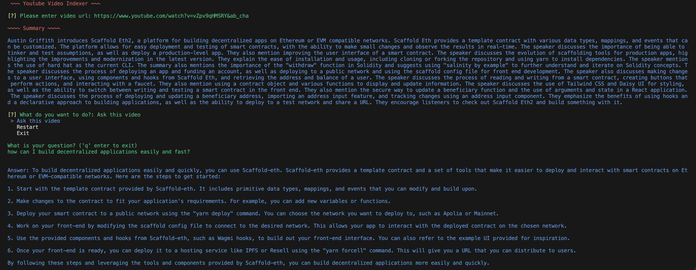

An interactive CLI that summarizes YouTube videos as well as creating in-memory embeddings for the video content, to make the content queryable. In other words, you can summarize and chat with YouTube videos.

## Usage

First create a **.env** file from **.env.example**, and populate OPENAI_API_KEY within.

```console
python3 -m venv .;
source bin/activate;
pip install -r req.txt;
python ./main.py;
```


